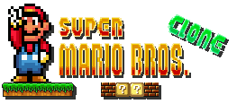

Super Mario Bros. Clone
==========

A clone of Super Mario Bros. 16-bit version game.

### About
This game is based of the Super Mario Bros. 16-bit version featured on Super Mario All-Starts for the Super Nintendo (SNES). The game is written in Java an using the [LibGdx](http://libgdx.badlogicgames.com/) engine.

Features of the game:
* Mini Mario turns into big Mario with the help of mushrooms.
* If you walk of the platform into the deep, you will die.
* Goomba's (enemies) will kill Mario, Mario can kill the Goomba's by jumping on their heads.
* Jump up against bricks, they will be destroyed if you are big Mario.
* Bonus bricks which can contain multiple Mushrooms.
* At the end of the level you can slide down the flag, you will then walk automatically to the castle. The game will then restart.
* Sound effects and music.

The project is updated to work with the new LibGdx release (1.4.1) which uses Gradle and has a different structure..

I am no longer adding new features to the game. Though, if you still find some bugs, just let me know (I might fix it)!

Here is a video demo:

### Download

[Click here](https://github.com/ArjanFrans/mario-game/releases/download/1/mario-game-1.0.jar) to download the game. You need [Java](https://java.com/nl/download/) to be able to run it.

### Development setup

1.  Install Java JDK.
2   Install the Android SDK.
2.  Install Gradle.
3.  (I only tried this with IntelliJ Community Edition) Import the project into IntelliJ. Setup the project with the default settings.

